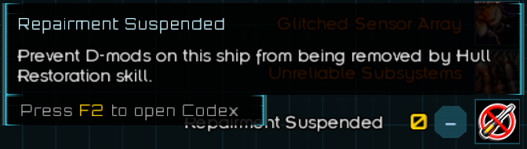
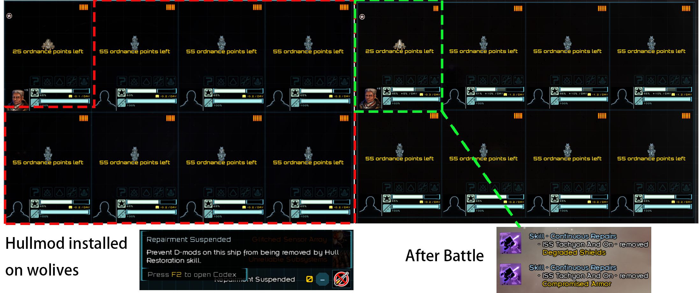

# Don't Repair This Ship - Disable Hull Restoration

## Installation

1. Unzip the mod
2. Put the `Dont_Repair_This_Ship_src` folder into your `Starsector/mods/` directory
3. Enable the mod in the launcher

## Save Compatibility

- Safe to add to an existing save
- NOT safe to remove after being enabled

## Mod Compatibility

- No known mod conflicts at this time.
- Compatible with the [Second Command](https://fractalsoftworks.com/forum/index.php?topic=30407.0) Continuous Repairs skill (v1.8.2).

